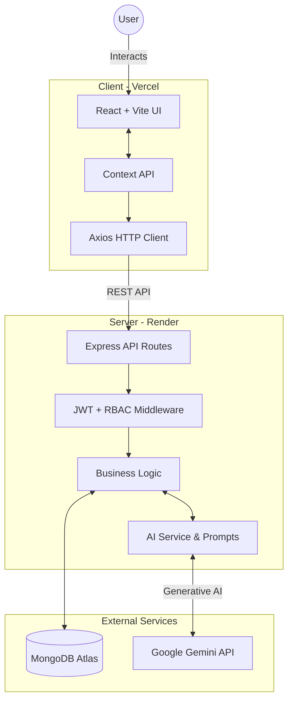

# 🚀 LearnFlow AI

> **AI-powered Customer Journey Orchestrator for Corporate Learning & Development.**

LearnFlow AI is an enterprise-grade platform designed to streamline and automate customer support, learning journeys, and targeted marketing campaigns using the power of Google's Gemini AI.

---

## 🌐 Live Demo

- **Frontend:** [https://learn-flow-ai-chi.vercel.app/](https://learn-flow-ai-chi.vercel.app/)
- **Backend API Health Check:** [https://learnflow-ai-ywhi.onrender.com/api/health](https://learnflow-ai-ywhi.onrender.com/api/health)

---

## 🔑 Demo Accounts (Role-Based Access)

The platform features a comprehensive Role-Based Access Control (RBAC) system. You can test the application using the following seeded accounts:

| Role | Email | Password | Access Level |
|---|---|---|---|
| **Admin** | `admin@learnflow.ai` | `Admin@1234` | Full system access, all reports, AI usage tracking. |
| **Service Agent** | `agent@learnflow.ai` | `Agent@1234` | Ticket management, user profiles, AI drafting. |
| **Marketing Manager** | `marketing@learnflow.ai` | `Mark@1234` | Campaign orchestration, segment creation, campaign reports. |
| **Sales Manager** | `sales@learnflow.ai` | `Sales@1234` | Lead/Customer tracking, analytics, journey overviews. |
| **Customer** | `customer@learnflow.ai` | `Customer@1234` | Personal learning journeys, own tickets, notifications. |

---

## ✨ Key Features

1. **Intelligent Dynamic Dashboards:** Tailored statistical dashboards using `Recharts` based on the logged-in user's role and permissions.
2. **AI-Powered Assistance (Gemini 1.5 Flash):**
   - **Ticket Summarization:** Instantly summarize long support threads.
   - **Intent Classification:** Automatically classify user inquiries.
   - **Draft Responses:** Generate intelligent context-aware replies for support agents.
   - **Sentiment Analysis:** Detect customer sentiment for prioritization.
3. **Omnichannel Campaign Orchestration:** Manage segmented marketing pushes and track performance metrics.
4. **Learning Journey Tracking:** Visualize and manage customer progression through specific corporate learning paths.
5. **Secure Authentication & RBAC:** JWT-based stateless authentication with robust role verification middleware.

---

## 🛠 Tech Stack

| Layer | Technology |
|---|---|
| **Frontend** | React, Vite, Tailwind CSS, `shadcn/ui`, Framer Motion, React Router, Axios, Recharts |
| **Backend** | Node.js, Express.js, JWT, bcryptjs, Zod, Google Generative AI SDK |
| **Database** | MongoDB Atlas (Mongoose) |
| **Deployment** | Vercel (Frontend), Render (Backend) |

---

## 🏗 Architecture



---

## 📂 Project Structure

```text
learnflow-ai/
├── client/                 # React + Vite frontend (deployed to Vercel)
│   ├── src/
│   │   ├── components/     # Reusable UI components (shadcn/ui)
│   │   ├── context/        # React context (AuthContext)
│   │   ├── pages/          # Dashboard, Reports, Login, etc.
│   │   ├── services/       # Axios API integrations
│   │   └── index.css       # Global styles and Tailwind configuration
│   └── vercel.json         # Vercel proxy and SPA routing configuration
│
├── server/                 # Node.js + Express backend (deployed to Render)
│   ├── src/
│   │   ├── ai/             # Google Gemini AI prompts and services
│   │   ├── config/         # MongoDB connection and dummy data seeding scripts
│   │   ├── controllers/    # API Request handlers
│   │   ├── middleware/     # Auth, RBAC, and error handlers
│   │   ├── models/         # Mongoose schemas (User, Ticket, Campaign, etc.)
│   │   └── routes/         # Express API routes
│   └── package.json        
│
├── .env.example
├── render.yaml             # Render deployment configuration blueprint
└── README.md
```

---

## 💻 Local Development

### 1. Database & AI Setup
1. Create a free [MongoDB Atlas](https://www.mongodb.com/atlas) cluster.
2. Get a free [Google Gemini API Key](https://aistudio.google.com/).

### 2. Backend Setup
```bash
cd server
npm install

# Copy .env.example to .env and fill in MONGODB_URI and GEMINI_API_KEY
cp ../.env.example .env 

# Seed the database with Roles, Users, and Dummy Data
npm run seed
node src/config/seed-dummy-data.js

# Start the server
npm run dev
```

### 3. Frontend Setup
```bash
cd client
npm install
npm run dev
```

The frontend will be available at `http://localhost:5173`.
